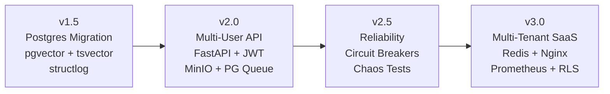
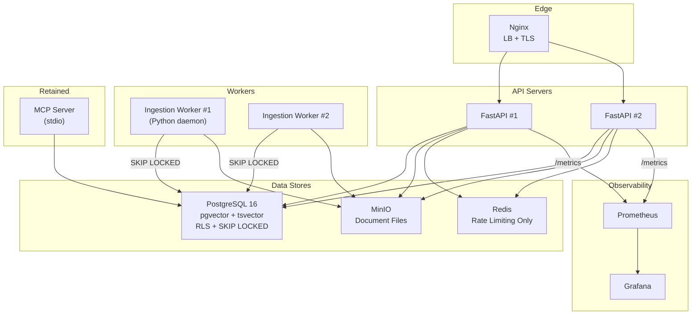
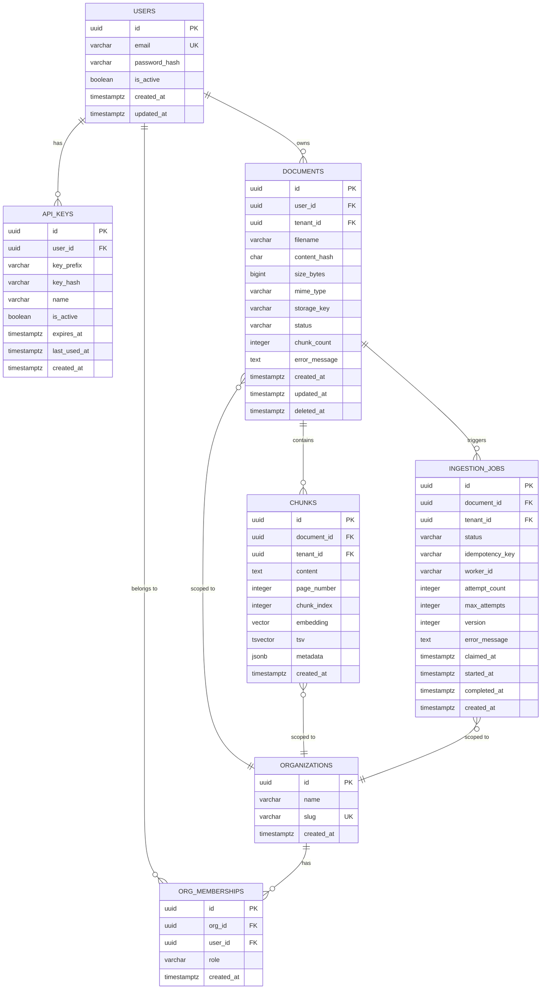

# Final Architecture Decision Record (ADR)
## AI Research Platform — Definitive Blueprint

**Status:** APPROVED FOR IMPLEMENTATION  
**Author:** Principal Engineer  
**Date:** 2026-08-05  
**Scope:** v1.5 through v3.0, ~9 weeks, one engineer

---

## Design Philosophy

Three documents preceded this ADR: a production hardening review, an evolution roadmap, and a critical architecture review. They disagreed on fundamental technology choices. This document resolves every disagreement and produces the final, implementable design.

The governing principle is **Postgres Maximalism**: maximize the capabilities of a single, well-understood database before paying the operational tax of additional stateful systems. PostgreSQL handles relational data, vector search (pgvector), full-text search (tsvector), and job queuing (SKIP LOCKED). Additional infrastructure enters **only** when PostgreSQL provably cannot serve the requirement.

---

# Part 1: Architecture Decision Records

## ADR-001: ChromaDB vs. pgvector

| | ChromaDB (Roadmap) | pgvector (Critique) |
|--|-----|-------|
| **ACID transactions** | ❌ No. Partial writes on crash. | ✅ Full transaction support. |
| **Tenant isolation** | ❌ Per-user collections (hack). Post-filter `top_k` problem. | ✅ Row-Level Security. `WHERE user_id = :uid` applied before index scan. |
| **BM25 / full-text** | ❌ Separate in-memory index. O(N) rebuild per cold start. | ✅ `tsvector` + GIN index. Persistent. O(log N) lookup. |
| **Crash safety** | ❌ Requires staging-collection workaround. | ✅ INSERT inside transaction. Rollback on crash. Zero orphans. |
| **JOINs with metadata** | ❌ Separate system. Manual correlation. | ✅ Native JOIN with documents, users, orgs. |
| **Backup/restore** | ❌ No built-in tooling. Copy SQLite files manually. | ✅ `pg_dump`. Point-in-time recovery with WAL archiving. |
| **Horizontal scaling** | ❌ Single-process SQLite backend. | ⚠️ Single-server, but supports read replicas. |
| **HNSW quality** | ✅ Good. | ✅ Equivalent. pgvector 0.7+ supports HNSW with comparable recall. |

> **Decision: pgvector.** It eliminates an entire class of distributed consistency problems (staging collections, per-user collection management, backup gaps) and makes hybrid retrieval a single indexed SQL query instead of two separate systems stitched together with Python.

**When this changes:** If vector volume exceeds ~50M rows and filtered search latency degrades, migrate to Qdrant or Weaviate. The retrieval service interface doesn't change — only the implementation behind it.

---

## ADR-002: Celery + Redis vs. PostgreSQL Job Queue

| | Celery + Redis (Roadmap) | PostgreSQL SKIP LOCKED (Critique) |
|--|-----|-------|
| **Transactional enqueue** | ❌ Two systems. Postgres commit + Redis enqueue are separate operations. If Redis is down after Postgres commits, document is `pending` forever. | ✅ Document + job created in one ACID transaction. Either both exist or neither does. |
| **Double-processing** | ⚠️ Requires Redis distributed lock (SETNX) as additional mechanism. | ✅ `SELECT ... FOR UPDATE SKIP LOCKED` guarantees exactly one worker claims each job. No additional locking needed. |
| **Retry with backoff** | ✅ Built-in. | ⚠️ Manual. `attempt_count < max_attempts` + exponential delay logic in worker. |
| **Monitoring** | ✅ Flower dashboard. | ⚠️ Custom. Query `ingestion_jobs` table. |
| **Operational complexity** | ❌ Two additional processes (Redis + Celery). Broker config, worker concurrency, serialization format, result backend. | ✅ Zero new dependencies. Worker is a Python loop polling one SQL query. |
| **Task persistence** | ✅ Redis persists tasks (with AOF). | ✅ PostgreSQL WAL. Strictly more durable. |

> **Decision: PostgreSQL SKIP LOCKED.** The transactional enqueue guarantee alone justifies this. We have one task type (`ingest_document`) with low throughput (tens of jobs per hour, not thousands per second). Celery's complexity is not justified.

**When this changes:** If task volume exceeds ~1,000 jobs/minute, or we need task chaining / workflows / scheduled tasks, introduce Celery or Temporal.

---

## ADR-003: Redis — When and Why

| Version | Redis? | Justification |
|---------|--------|--------------|
| v1.5 | ❌ | Single process. No shared state needed. |
| v2.0 | ❌ | Single API server. In-memory rate limiter is correct. Postgres queue eliminates broker need. |
| v2.5 | ❌ | Postgres advisory locks for ingestion. Circuit breakers are in-process. |
| v3.0 | ✅ | Multiple API instances behind Nginx. In-memory rate limiters are per-process — User A sends 100 req/s × 3 instances = 300 req/s, each instance sees only 100. Redis provides shared atomic counters for distributed rate limiting. |

> **Decision: Introduce Redis in v3.0 for distributed rate limiting only.** One purpose, one defensible reason. Not for caching (Postgres shared buffers handle hot data), not for queues (Postgres SKIP LOCKED), not for locks (Postgres advisory locks).

**Interview defense:** *"I could have introduced Redis in v2.0 for Celery, but I realized Postgres SKIP LOCKED gave me transactional job enqueuing for free. Redis enters in v3.0 because multiple API instances need shared rate-limit counters, and hitting Postgres for every request adds connection pool pressure. Redis INCR with TTL is sub-millisecond and purpose-built for this."*

---

## ADR-004: Rate Limiting — Semaphore vs. Token Bucket

The roadmap proposed `asyncio.Semaphore(5)` to enforce Gemini's 15 RPM limit. The critique correctly identified this as wrong: a semaphore limits **concurrency** (5 simultaneous calls), not **rate** (15 per minute). Five calls completing in 1 second means the next 5 fire immediately.

> **Decision: Token bucket via `aiolimiter.AsyncLimiter(15, 60)` for LLM rate limiting. Semaphore retained for concurrency bounding (prevent connection exhaustion), but not for rate limiting. These are separate concerns.**

```python
from aiolimiter import AsyncLimiter

# Rate: max 15 calls per 60 seconds (token bucket)
_llm_rate_limiter = AsyncLimiter(15, 60)

# Concurrency: max 5 simultaneous in-flight calls
_llm_concurrency = asyncio.Semaphore(5)


async def guarded_llm_call(llm, prompt: str) -> str:
    await _llm_rate_limiter.acquire()  # Enforces RPM
    async with _llm_concurrency:  # Bounds concurrency
        return await asyncio.wait_for(llm.acomplete(prompt), timeout=30)
```

---

## ADR-005: Parallel Retrieval — Threads vs. Processes vs. SQL

The roadmap proposed `asyncio.gather(to_thread(dense), to_thread(sparse))`. The critique noted this is a GIL trap for CPU-bound BM25 tokenization.

> **Decision: Neither. With pgvector + tsvector, both dense and sparse retrieval are SQL queries executed by PostgreSQL's own parallelism. Python submits two async queries, PostgreSQL handles parallelism internally. No GIL, no threadpool, no process pool.**

```python
async def hybrid_search(query: str, user_id: UUID, top_k: int = 5, db: AsyncSession):
    query_embedding = embed_model.encode(query)  # ~5ms local, CPU-bound but fast

    # Both queries run concurrently via asyncio.gather
    dense_task = db.execute(text("""
        SELECT id, content, page_number, metadata, document_id
        FROM chunks WHERE user_id = :uid
        ORDER BY embedding <=> :emb LIMIT :k
    """), {"uid": user_id, "emb": str(query_embedding.tolist()), "k": top_k * 2})

    sparse_task = db.execute(text("""
        SELECT id, content, page_number, metadata, document_id,
               ts_rank_cd(tsv, websearch_to_tsquery('english', :q)) as score
        FROM chunks WHERE user_id = :uid AND tsv @@ websearch_to_tsquery('english', :q)
        ORDER BY score DESC LIMIT :k
    """), {"uid": user_id, "q": query, "k": top_k * 2})

    dense_rows, sparse_rows = await asyncio.gather(dense_task, sparse_task)
    return rrf_fusion(dense_rows.fetchall(), sparse_rows.fetchall(), top_k)
```

---

## ADR-006: Multi-Tenancy — SQLAlchemy Hooks vs. PostgreSQL RLS

The roadmap proposed SQLAlchemy `do_orm_execute` event hooks with PostgreSQL RLS as a "backstop." The critique correctly identified that event hooks are bypassable via raw SQL and don't intercept UPDATE/DELETE.

> **Decision: PostgreSQL Row-Level Security (RLS) as the primary enforcement mechanism. Set `app.current_tenant` as a session variable in FastAPI middleware. Every query — ORM, raw SQL, direct psql — is filtered by the database itself.**

```python
# Middleware sets tenant context on every request
@app.middleware("http")
async def set_tenant_context(request: Request, call_next):
    tenant_id = get_tenant_from_jwt(request)
    async with get_db() as db:
        await db.execute(
            text("SET LOCAL app.current_tenant = :tid"), {"tid": str(tenant_id)}
        )
        request.state.db = db
        return await call_next(request)
```

```sql
-- PostgreSQL RLS policy (unforgeable)
ALTER TABLE chunks ENABLE ROW LEVEL SECURITY;
CREATE POLICY tenant_isolation ON chunks
    USING (tenant_id = current_setting('app.current_tenant')::uuid);

-- Same for documents, ingestion_jobs
```

---

## ADR-007: Caching Strategy

The roadmap proposed Redis caching for embeddings, search results, and metadata. The critique argued against it.

> **Decision: No application-level cache until profiling proves PostgreSQL is the bottleneck.** PostgreSQL's shared buffers automatically cache frequently accessed index pages and data pages. With proper indexes (HNSW for vectors, GIN for tsvector, B-tree for foreign keys), query latency is dominated by index lookup, not disk I/O. Adding a Redis cache layer introduces cache invalidation complexity and consistency bugs without proven necessity.

**When this changes:** If Prometheus shows PostgreSQL CPU at >70% sustained during peak search load, introduce a read-through Redis cache for search results with a 60-second TTL and invalidation on ingestion. Cache embeddings only if the embedding model is remote (API call), not local (in-process).

---

## ADR-008: Object Storage

Both documents agreed on MinIO.

> **Decision: MinIO (S3-compatible) for document file storage.** Upload goes to MinIO first, then metadata to Postgres. Workers read from MinIO, not local filesystem. Same `boto3` code works with AWS S3 via config change.

---

## ADR-009: Circuit Breakers

Both documents agreed on circuit breakers for external APIs. The critique noted in-memory state resets on restart.

> **Decision: In-process circuit breaker per external API (Gemini, Tavily). State reset on restart is acceptable — external API health is quickly re-discovered (within 5 failed calls). Persisting circuit breaker state in a database adds latency to every API call for negligible benefit.**

---

## ADR-010: Observability

> **Decision: structlog (v1.5) → Prometheus + Grafana (v3.0).** structlog replaces all `print()` statements immediately. Prometheus metrics are deferred to v3.0 because a single-server deployment can be monitored with structured log analysis. Multi-instance deployment requires aggregated metrics.

---

# Part 2: Final Architecture

## Version Progression



## v3.0 Final Architecture Diagram



## Final Technology Stack

| Technology | Purpose | Version Introduced |
|------------|---------|-------------------|
| **PostgreSQL 16** | Relational data, vectors (pgvector), full-text (tsvector), job queue (SKIP LOCKED), RLS | v1.5 |
| **pgvector** | HNSW vector index for dense retrieval | v1.5 |
| **FastAPI** | HTTP API framework (async) | v2.0 |
| **SQLAlchemy (async)** | ORM + connection pooling | v2.0 |
| **Alembic** | Database migrations | v2.0 |
| **MinIO** | S3-compatible document storage | v2.0 |
| **PyJWT + bcrypt** | Authentication | v2.0 |
| **sentence-transformers** | Local embedding model (all-MiniLM-L6-v2) | v1.5 |
| **structlog** | Structured JSON logging → stderr | v1.5 |
| **tenacity** | Retry with exponential backoff | v1.5 |
| **aiolimiter** | Token bucket rate limiting | v1.5 |
| **Redis** | Distributed rate limiting (multi-instance) | v3.0 |
| **Nginx** | Reverse proxy + load balancer | v3.0 |
| **Prometheus** | Metrics collection | v3.0 |
| **Grafana** | Metrics visualization + alerting | v3.0 |
| **Docker Compose** | Local dev orchestration | v2.0 |
| **locust** | Load testing | v3.0 |

---

# Part 3: Database Architecture

## ER Diagram



## Complete Schema with Indexes

```sql
-- =============================================================
-- Extensions
-- =============================================================
CREATE EXTENSION IF NOT EXISTS "pgcrypto";   -- gen_random_uuid()
CREATE EXTENSION IF NOT EXISTS "vector";     -- pgvector

-- =============================================================
-- Users
-- =============================================================
CREATE TABLE users (
    id              UUID PRIMARY KEY DEFAULT gen_random_uuid(),
    email           VARCHAR(255) UNIQUE NOT NULL,
    password_hash   VARCHAR(255) NOT NULL,
    is_active       BOOLEAN NOT NULL DEFAULT true,
    created_at      TIMESTAMPTZ NOT NULL DEFAULT now(),
    updated_at      TIMESTAMPTZ NOT NULL DEFAULT now()
);
-- email lookups happen on every login
CREATE INDEX idx_users_email ON users (email);

-- =============================================================
-- API Keys
-- =============================================================
CREATE TABLE api_keys (
    id              UUID PRIMARY KEY DEFAULT gen_random_uuid(),
    user_id         UUID NOT NULL REFERENCES users(id) ON DELETE CASCADE,
    key_prefix      VARCHAR(8) NOT NULL,       -- e.g. "sk-a1b2" for identification
    key_hash        VARCHAR(255) NOT NULL,      -- bcrypt hash of full key
    name            VARCHAR(100) NOT NULL,
    is_active       BOOLEAN NOT NULL DEFAULT true,
    expires_at      TIMESTAMPTZ,
    last_used_at    TIMESTAMPTZ,
    created_at      TIMESTAMPTZ NOT NULL DEFAULT now()
);
-- Auth middleware looks up by prefix, then verifies hash
CREATE INDEX idx_api_keys_prefix ON api_keys (key_prefix) WHERE is_active = true;

-- =============================================================
-- Organizations (v3.0)
-- =============================================================
CREATE TABLE organizations (
    id              UUID PRIMARY KEY DEFAULT gen_random_uuid(),
    name            VARCHAR(255) NOT NULL,
    slug            VARCHAR(100) UNIQUE NOT NULL,
    created_at      TIMESTAMPTZ NOT NULL DEFAULT now()
);

CREATE TABLE org_memberships (
    id              UUID PRIMARY KEY DEFAULT gen_random_uuid(),
    org_id          UUID NOT NULL REFERENCES organizations(id) ON DELETE CASCADE,
    user_id         UUID NOT NULL REFERENCES users(id) ON DELETE CASCADE,
    role            VARCHAR(20) NOT NULL DEFAULT 'viewer'
                        CHECK (role IN ('admin', 'editor', 'viewer')),
    created_at      TIMESTAMPTZ NOT NULL DEFAULT now(),
    UNIQUE (org_id, user_id)
);
CREATE INDEX idx_memberships_user ON org_memberships (user_id);

-- =============================================================
-- Documents
-- =============================================================
CREATE TABLE documents (
    id              UUID PRIMARY KEY DEFAULT gen_random_uuid(),
    user_id         UUID NOT NULL REFERENCES users(id) ON DELETE CASCADE,
    tenant_id       UUID NOT NULL REFERENCES organizations(id),
    filename        VARCHAR(500) NOT NULL,
    content_hash    CHAR(64) NOT NULL,          -- SHA-256
    size_bytes      BIGINT NOT NULL,
    mime_type       VARCHAR(100),
    storage_key     VARCHAR(500),               -- MinIO object key
    status          VARCHAR(20) NOT NULL DEFAULT 'pending'
                        CHECK (status IN ('pending', 'processing', 'ready', 'failed')),
    chunk_count     INTEGER NOT NULL DEFAULT 0,
    error_message   TEXT,
    created_at      TIMESTAMPTZ NOT NULL DEFAULT now(),
    updated_at      TIMESTAMPTZ NOT NULL DEFAULT now(),
    deleted_at      TIMESTAMPTZ,                -- Soft delete
    UNIQUE (tenant_id, content_hash)            -- Scoped per org, not per user
);
-- List documents for a tenant, excluding soft-deleted
CREATE INDEX idx_docs_tenant_active ON documents (tenant_id, created_at DESC)
    WHERE deleted_at IS NULL;
-- Status-filtered queries (worker polling for 'processing' docs)
CREATE INDEX idx_docs_status ON documents (status) WHERE deleted_at IS NULL;

-- =============================================================
-- Chunks (vectors + full-text)
-- =============================================================
CREATE TABLE chunks (
    id              UUID PRIMARY KEY DEFAULT gen_random_uuid(),
    document_id     UUID NOT NULL REFERENCES documents(id) ON DELETE CASCADE,
    tenant_id       UUID NOT NULL REFERENCES organizations(id),
    content         TEXT NOT NULL,
    page_number     INTEGER,
    chunk_index     INTEGER NOT NULL,
    embedding       vector(384) NOT NULL,       -- all-MiniLM-L6-v2
    tsv             tsvector GENERATED ALWAYS AS (
                        to_tsvector('english', content)
                    ) STORED,
    metadata        JSONB NOT NULL DEFAULT '{}',
    created_at      TIMESTAMPTZ NOT NULL DEFAULT now()
);
-- Dense retrieval: HNSW index for cosine similarity
CREATE INDEX idx_chunks_embedding ON chunks
    USING hnsw (embedding vector_cosine_ops)
    WITH (m = 16, ef_construction = 64);
-- Sparse retrieval: GIN index for full-text search
CREATE INDEX idx_chunks_tsv ON chunks USING gin (tsv);
-- Chunk lookups by document
CREATE INDEX idx_chunks_document ON chunks (document_id);
-- Tenant-scoped queries
CREATE INDEX idx_chunks_tenant ON chunks (tenant_id);

-- =============================================================
-- Ingestion Jobs (PostgreSQL Job Queue)
-- =============================================================
CREATE TABLE ingestion_jobs (
    id              UUID PRIMARY KEY DEFAULT gen_random_uuid(),
    document_id     UUID NOT NULL REFERENCES documents(id) ON DELETE CASCADE,
    tenant_id       UUID NOT NULL REFERENCES organizations(id),
    status          VARCHAR(20) NOT NULL DEFAULT 'queued'
                        CHECK (status IN ('queued', 'claimed', 'running',
                                          'completed', 'failed', 'dead')),
    idempotency_key VARCHAR(255) NOT NULL,
    worker_id       VARCHAR(100),
    attempt_count   INTEGER NOT NULL DEFAULT 0,
    max_attempts    INTEGER NOT NULL DEFAULT 3,
    version         INTEGER NOT NULL DEFAULT 1, -- Optimistic lock
    error_message   TEXT,
    claimed_at      TIMESTAMPTZ,
    started_at      TIMESTAMPTZ,
    completed_at    TIMESTAMPTZ,
    created_at      TIMESTAMPTZ NOT NULL DEFAULT now(),
    UNIQUE (tenant_id, idempotency_key)         -- Scoped per tenant
);
-- Worker dequeue: partial index on claimable jobs only
CREATE INDEX idx_jobs_dequeue ON ingestion_jobs (created_at ASC)
    WHERE status = 'queued';
-- Job lookup by document
CREATE INDEX idx_jobs_document ON ingestion_jobs (document_id);

-- =============================================================
-- Row-Level Security (v3.0)
-- =============================================================
ALTER TABLE documents ENABLE ROW LEVEL SECURITY;
CREATE POLICY tenant_isolation_docs ON documents
    USING (tenant_id = current_setting('app.current_tenant', true)::uuid);

ALTER TABLE chunks ENABLE ROW LEVEL SECURITY;
CREATE POLICY tenant_isolation_chunks ON chunks
    USING (tenant_id = current_setting('app.current_tenant', true)::uuid);

ALTER TABLE ingestion_jobs ENABLE ROW LEVEL SECURITY;
CREATE POLICY tenant_isolation_jobs ON ingestion_jobs
    USING (tenant_id = current_setting('app.current_tenant', true)::uuid);
```

### Schema Design Rationale

| Decision | Rationale |
|----------|-----------|
| **`CHAR(64)` for content_hash** | SHA-256 is always 64 hex chars. Fixed-length avoids `varchar` overhead. |
| **`tenant_id` denormalized onto chunks** | Avoids a JOIN through documents on every vector search. RLS can filter directly. |
| **`UNIQUE(tenant_id, content_hash)`** | Prevents duplicate files within the same org. Different orgs can have the same file. |
| **`UNIQUE(tenant_id, idempotency_key)`** | Scoped to tenant. Prevents a malicious tenant from blocking another's uploads. |
| **`deleted_at` soft delete on documents** | Allows undo. `ON DELETE CASCADE` on chunks handles hard deletes when purged. |
| **Partial index `WHERE status = 'queued'`** | Workers only scan queued jobs. The index is tiny even with millions of completed jobs. |
| **`version` column on ingestion_jobs** | Optimistic locking for status updates. Worker reads version, updates with `WHERE version = :v`. |
| **Generated `tsvector` column** | Kept in sync with `content` automatically. No application-level maintenance. |
| **HNSW with `m=16, ef_construction=64`** | Balanced recall/speed. Higher `m` = better recall but more memory. 16 is the standard default. |
| **No `user_id` on chunks** | Chunks belong to documents, which belong to tenants. User attribution is on the document level, not the chunk level. RLS operates on `tenant_id`. |

### Migration Strategy

- **Tool:** Alembic with async SQLAlchemy.
- **Additive changes:** Deploy migration before code. New columns have defaults; old code ignores them.
- **Destructive changes:** Three-phase: (1) stop writing, (2) deploy code that doesn't read, (3) drop column.
- **Vector dimension changes:** Requires re-embedding all chunks. Treat as a data migration, not a schema migration.

### Soft Delete Policy

- `documents.deleted_at IS NOT NULL` hides the document from queries.
- Chunks are NOT soft-deleted. When a document is hard-purged (`DELETE FROM documents WHERE deleted_at < now() - interval '30 days'`), `ON DELETE CASCADE` removes chunks atomically.
- A periodic cleanup job hard-deletes documents older than 30 days.

### Audit Logging

- v2.0: `created_at` and `updated_at` on all tables. Sufficient for debugging.
- v3.0: Add an `audit_log` table for sensitive operations (document deletion, role changes, API key creation). Append-only, immutable.

---

# Part 4: API Architecture

## Authentication

- **Primary:** JWT access token (15-minute expiry) + refresh token (7-day expiry, stored hashed in DB).
- **Programmatic:** API key (prefixed `sk-`, sent via `Authorization: Bearer sk-...`). Middleware checks prefix to distinguish JWT from API key.
- **Password hashing:** bcrypt with work factor 12.

## Endpoints

### Auth

| Method | Path | Description | Auth |
|--------|------|-------------|------|
| POST | `/api/v1/auth/register` | Create account | None |
| POST | `/api/v1/auth/login` | Get JWT + refresh token | None |
| POST | `/api/v1/auth/refresh` | Rotate access token | Refresh token |
| POST | `/api/v1/auth/api-keys` | Create API key | JWT |
| GET | `/api/v1/auth/api-keys` | List API keys | JWT |
| DELETE | `/api/v1/auth/api-keys/{id}` | Revoke API key | JWT |

### Documents

| Method | Path | Description | Auth | Idempotency |
|--------|------|-------------|------|-------------|
| POST | `/api/v1/documents` | Upload document | JWT/Key | `Idempotency-Key` header required |
| GET | `/api/v1/documents` | List documents (paginated) | JWT/Key | — |
| GET | `/api/v1/documents/{id}` | Get document metadata | JWT/Key | — |
| DELETE | `/api/v1/documents/{id}` | Soft delete | JWT/Key | — |
| GET | `/api/v1/documents/{id}/chunks` | List chunks (paginated) | JWT/Key | — |

### Search

| Method | Path | Description | Auth |
|--------|------|-------------|------|
| POST | `/api/v1/search` | Hybrid search (dense + sparse + RRF) | JWT/Key |
| POST | `/api/v1/search/semantic` | Dense-only search | JWT/Key |
| POST | `/api/v1/search/keyword` | Sparse-only (tsvector) search | JWT/Key |

### Evaluation

| Method | Path | Description | Auth |
|--------|------|-------------|------|
| POST | `/api/v1/evaluate/relevance` | CRAG relevance grading | JWT/Key |

### Jobs

| Method | Path | Description | Auth |
|--------|------|-------------|------|
| GET | `/api/v1/jobs/{id}` | Job status | JWT/Key |
| GET | `/api/v1/jobs` | List jobs (paginated) | JWT/Key |

### Health

| Method | Path | Description | Auth |
|--------|------|-------------|------|
| GET | `/health` | Shallow (process alive) | None |
| GET | `/health/ready` | Deep (DB, MinIO reachable) | None |

## Pagination

Cursor-based for all list endpoints. Offset-based pagination is O(N) for large offsets.

```json
// Request
GET /api/v1/documents?limit=20&cursor=eyJpZCI6IjEyMzQifQ==

// Response
{
  "items": [...],
  "next_cursor": "eyJpZCI6IjU2NzgifQ==",
  "has_more": true
}
```

## Error Handling

Standard error envelope for all non-2xx responses:

```json
{
  "error": {
    "code": "DOCUMENT_NOT_FOUND",
    "message": "Document with ID '...' does not exist or has been deleted.",
    "details": {}
  }
}
```

| Status Code | When |
|-------------|------|
| 400 | Malformed request, invalid parameters |
| 401 | Missing or invalid authentication |
| 403 | Authenticated but not authorized (wrong role, wrong tenant) |
| 404 | Resource not found |
| 409 | Conflict (duplicate content_hash, idempotency key collision) |
| 422 | Validation error (file too large, unsupported format) |
| 429 | Rate limited |
| 500 | Internal error |

## Versioning

URL-prefix (`/api/v1/`). When breaking changes are needed, deploy `/api/v2/` alongside and deprecate v1 after migration period.

---

# Part 5: Project Directory Structure

```
ai-research-platform/
├── alembic/                          # Database migrations
│   ├── versions/
│   ├── env.py
│   └── alembic.ini
│
├── src/
│   ├── main.py                       # FastAPI app factory, middleware, lifespan
│   │
│   ├── core/                         # Shared kernel (no business logic)
│   │   ├── config.py                 # Pydantic settings, env loading
│   │   ├── database.py               # Engine, session factory, pool config
│   │   ├── security.py               # JWT encode/decode, bcrypt, API key verify
│   │   ├── exceptions.py             # App-level exception hierarchy
│   │   ├── pagination.py             # Cursor encode/decode, paginated response
│   │   └── logging.py                # structlog configuration
│   │
│   ├── auth/                         # Authentication & API keys
│   │   ├── models.py                 # User, ApiKey SQLAlchemy models
│   │   ├── schemas.py                # Pydantic request/response schemas
│   │   ├── service.py                # Business logic (register, login, key CRUD)
│   │   ├── routes.py                 # FastAPI router
│   │   └── dependencies.py           # get_current_user, require_role
│   │
│   ├── documents/                    # Document upload & management
│   │   ├── models.py                 # Document SQLAlchemy model
│   │   ├── schemas.py
│   │   ├── service.py                # Upload, list, delete, dedup logic
│   │   ├── storage.py                # MinIO client wrapper
│   │   └── routes.py
│   │
│   ├── ingestion/                    # Ingestion pipeline & worker
│   │   ├── models.py                 # IngestionJob, Chunk SQLAlchemy models
│   │   ├── schemas.py
│   │   ├── pipeline.py               # Chunking (SemanticSplitter) + embedding
│   │   ├── worker.py                 # SKIP LOCKED polling daemon
│   │   └── routes.py                 # Job status endpoints
│   │
│   ├── retrieval/                    # Search & hybrid retrieval
│   │   ├── schemas.py
│   │   ├── service.py                # Hybrid search, RRF fusion
│   │   └── routes.py
│   │
│   ├── evaluation/                   # CRAG evaluation & LLM gateway
│   │   ├── schemas.py
│   │   ├── llm_gateway.py            # Rate limit + retry + circuit breaker
│   │   ├── service.py                # Relevance grading
│   │   └── routes.py
│   │
│   ├── tenants/                      # Multi-tenancy (v3.0)
│   │   ├── models.py                 # Organization, OrgMembership models
│   │   ├── schemas.py
│   │   ├── service.py
│   │   ├── middleware.py             # SET LOCAL app.current_tenant
│   │   └── routes.py
│   │
│   └── observability/                # Metrics & health (v3.0)
│       ├── metrics.py                # Prometheus counters/histograms
│       └── health.py                 # Shallow + deep health checks
│
├── mcp_server/                       # MCP server interface (retained)
│   ├── server.py                     # Stdio entry point
│   └── adapters/                     # Adapters that call src/ services
│
├── tests/
│   ├── conftest.py                   # Fixtures: test DB, test client, factories
│   ├── unit/                         # Pure logic: RRF, token bucket, JWT
│   ├── integration/                  # DB + API: upload→ingest→search flow
│   ├── concurrency/                  # SKIP LOCKED, optimistic lock races
│   └── load/                         # locust scripts
│
├── docker/
│   ├── Dockerfile                    # Multi-stage: API + Worker from same image
│   ├── docker-compose.yml            # Dev: PG + MinIO + API + Worker
│   └── docker-compose.prod.yml       # Prod: + Nginx + Redis + Prometheus + Grafana
│
├── requirements.in                   # Human-maintained dependency constraints
├── requirements.txt                  # pip-compile generated lockfile
└── README.md
```

### Dependency Direction

```
routes → service → models + core
                  → external (MinIO, LLM API)

routes NEVER import from other modules' services.
services MAY import from core/.
models are standalone.
```

---

# Part 6: Implementation Roadmap

## Milestone 1 — PostgreSQL Foundation (Week 1–2)

**Goal:** Replace ChromaDB + SimpleDocStore + in-memory BM25 with PostgreSQL + pgvector + tsvector. Retain the MCP server as the interface.

**Deliverables:**
- PostgreSQL schema (chunks table with vector + tsvector columns)
- Alembic initial migration
- Ingestion pipeline rewritten: `SemanticSplitterNodeParser` → embed → `INSERT INTO chunks`
- Hybrid retrieval service: pgvector query + tsvector query + RRF fusion
- MCP server adapters refactored to call new retrieval service
- structlog replaces all `print()` statements
- `pip-compile` pinned dependencies
- LLM gateway with `aiolimiter` token bucket + `tenacity` retry + circuit breaker

**Tests:**
- Unit: RRF fusion algorithm, circuit breaker state machine, token bucket
- Integration: Ingest 3 PDFs → hybrid search → verify results ranked correctly
- MCP: Existing test suite passes against new Postgres backend

**Definition of Done:** MCP server works identically to v1.0 but backed by PostgreSQL instead of ChromaDB. Zero print statements. Pinned dependencies.

---

## Milestone 2 — Multi-User HTTP API (Week 3–5)

**Goal:** FastAPI HTTP API with authentication, document upload, async ingestion, and search.

**Deliverables:**
- FastAPI application with `/api/v1/` prefix
- User registration + login (JWT + refresh tokens)
- API key authentication
- Document upload → MinIO → Postgres metadata + ingestion job (single transaction)
- Ingestion worker daemon (SKIP LOCKED polling loop)
- Search endpoints (hybrid, semantic, keyword)
- Job status endpoint
- In-memory token bucket rate limiter (per-user)
- Cursor-based pagination on all list endpoints
- Idempotent upload (content hash + idempotency key)
- Docker Compose: PostgreSQL + MinIO + API + Worker

**Tests:**
- Unit: JWT generation/validation, password hashing, cursor encoding
- Integration: Full upload → ingest → search flow; duplicate upload returns 409; auth flow
- Concurrency: Two workers claim the same job (verify SKIP LOCKED prevents double-processing)

**Definition of Done:** Multiple users can register, upload documents, trigger ingestion, and search their own corpora via HTTP. No data leakage between users.

---

## Milestone 3 — Reliability & Chaos (Week 6–7)

**Goal:** Make the system survivable under real-world failure conditions.

**Deliverables:**
- Circuit breaker for Gemini + Tavily APIs (in LLM gateway)
- Optimistic locking on job status updates (version column)
- Dead letter status: jobs exceeding `max_attempts` move to `status = 'dead'`
- Worker heartbeat: `claimed_at` updated periodically; stale claims (>10 min) reset to `queued`
- Deep health check endpoint (`/health/ready`)
- Structured error responses for all endpoints

**Tests:**
- Chaos: Kill worker mid-ingestion → verify transaction rollback, no orphaned chunks
- Chaos: Block Gemini API → verify circuit breaker trips, fast-fail responses
- Concurrency: 10 concurrent uploads for the same user → verify dedup + idempotency
- Recovery: Worker restarts → picks up queued jobs automatically

**Definition of Done:** System recovers gracefully from worker crashes, API outages, and duplicate requests without data corruption.

---

## Milestone 4 — Multi-Tenant SaaS (Week 8–10)

**Goal:** Multi-organization support with RBAC, row-level security, horizontal scaling, and observability.

**Deliverables:**
- Organizations table + org_memberships + RBAC (admin/editor/viewer)
- `tenant_id` column on documents, chunks, ingestion_jobs
- PostgreSQL RLS policies (primary enforcement)
- Tenant context middleware (`SET LOCAL app.current_tenant`)
- Redis integration (distributed rate limiting only)
- Nginx reverse proxy + load balancer config
- Prometheus metrics (HTTP latency, search latency, job throughput, pool usage, circuit breaker state)
- Grafana dashboard
- Docker Compose: full stack (PG + MinIO + Redis + API×2 + Worker×2 + Nginx + Prometheus + Grafana)

**Tests:**
- Integration: Tenant A cannot see Tenant B's data (even via raw SQL through RLS)
- Integration: RBAC enforcement (viewer cannot upload, editor cannot manage roles)
- Load: 100 concurrent search requests via locust
- Concurrency: Rate limiter shared across two API instances (via Redis)

**Definition of Done:** Multiple organizations use the platform with complete data isolation, role-based access, and observable production metrics.

---

# Part 7: Distributed Systems Concepts Demonstrated

| Concept | Where It Appears | Why It Exists | How It Is Tested |
|---------|-----------------|---------------|------------------|
| **ACID Transactions** | Ingestion: document + job created atomically. Worker: chunks inserted in single transaction. | Prevents orphaned records on crash. | Kill worker mid-ingestion, verify rollback. |
| **Optimistic Locking** | `ingestion_jobs.version` column. Worker updates `WHERE version = :v`. | Prevents lost updates if two workers modify the same job. | Concurrent worker test: second update returns 0 rows. |
| **SKIP LOCKED (Pessimistic)** | Worker job claim query. | Guarantees exactly one worker processes each job. | Two workers poll simultaneously, verify no overlap. |
| **Token Bucket Rate Limiting** | `aiolimiter` for LLM API. Redis INCR for HTTP API (v3.0). | Prevents quota exhaustion (LLM) and abuse (HTTP). | Send 20 requests in 1 second, verify 429 after limit. |
| **Circuit Breaker** | LLM gateway for Gemini and Tavily. | Prevents cascade failure during sustained API outage. | Mock API returning 500s, verify breaker trips after threshold. |
| **Retry with Backoff** | `tenacity` decorator on LLM calls. | Handles transient network failures. | Mock intermittent 503, verify successful retry. |
| **Idempotency** | `UNIQUE(tenant_id, idempotency_key)` + content hash dedup. | Prevents duplicate processing on client retry. | Submit same upload twice, verify single job created. |
| **Dead Letter Queue** | Jobs with `status = 'dead'` after max attempts. | Isolates permanently failing jobs for manual inspection. | Ingest corrupt PDF 3 times, verify job moves to `dead`. |
| **Row-Level Security** | PostgreSQL RLS on chunks, documents, jobs. | Tenant data isolation enforced at database level. | Query from Tenant A's session, verify zero Tenant B rows. |
| **Connection Pooling** | SQLAlchemy `pool_size=10, max_overflow=20`. | Prevents TCP connection overhead and PG exhaustion. | Load test: 100 concurrent requests, verify no pool timeout. |
| **Horizontal Scaling** | Stateless API behind Nginx. Shared PG, MinIO, Redis. | Handles increased load by adding API instances. | Run 2 instances, verify round-robin and shared rate limits. |
| **Cursor-Based Pagination** | All list endpoints use encoded cursor, not offset. | O(1) page fetch regardless of dataset size. | Request page 1000, verify consistent latency. |

---

# Part 8: Interview Cheat Sheet

## PostgreSQL (pgvector + tsvector + SKIP LOCKED)

**Why:** Single system for relational data, vectors, full-text, and job queues. Eliminates distributed consistency between 3 separate databases.

**Biggest strength:** ACID transactions for vector writes. Crash = rollback. Zero orphaned data.

**Biggest weakness:** pgvector HNSW is slower than purpose-built vector DBs (Qdrant) at >10M vectors with complex metadata filtering.

**Q:** *"Why not use a dedicated vector database?"*  
**A:** *"At our scale (<1M vectors), pgvector's HNSW index provides equivalent recall and latency. The decisive advantage is transactional integrity — I can INSERT 200 vector chunks in a single transaction and they either all commit or none do. With ChromaDB, a crash mid-write leaves orphaned chunks that require a staging-collection workaround. pgvector also lets me JOIN vectors with document metadata and enforce row-level security in a single query. I'd switch to Qdrant if vector volume exceeded 10M and I needed filtered HNSW search with pre-filtering."*

**Q:** *"How does your hybrid search work?"*  
**A:** *"Two concurrent SQL queries. Dense: `ORDER BY embedding <=> query_vec` using the HNSW index. Sparse: `WHERE tsv @@ websearch_to_tsquery(query)` using the GIN index, ranked by `ts_rank_cd`. Both return top-2K candidates. Python applies Reciprocal Rank Fusion with k=60. The fused top-K results are returned. No in-memory BM25 index, no GIL issues, no O(N) rebuild on cold start."*

---

## PostgreSQL SKIP LOCKED

**Why:** Transactional job enqueuing. Document + job created atomically.

**Biggest strength:** No separate broker. No two-system consistency problem.

**Biggest weakness:** Polling adds latency (~1 second between job creation and worker pickup). Celery with Redis would be sub-100ms.

**Q:** *"Why not Celery?"*  
**A:** *"With Celery, creating a document in Postgres and enqueuing the ingestion task in Redis are two separate operations. If Redis is down after the Postgres commit, the document is stuck in 'pending' forever with no job to process it. With SKIP LOCKED, both the document record and the job record are created in the same ACID transaction. They either both exist or neither does. For our volume (tens of jobs per hour), the 1-second polling delay is irrelevant. I'd switch to Celery if I needed sub-second dispatch latency or complex task dependency graphs."*

---

## Redis (v3.0)

**Why:** Distributed rate limiting across multiple API instances.

**Biggest strength:** Sub-millisecond atomic INCR with TTL. Purpose-built for counters.

**Biggest weakness:** Single point of failure for rate limiting (but rate limiting failing open is acceptable — we're not billing).

**Q:** *"Why not rate-limit in Postgres?"*  
**A:** *"Rate limiting runs on every HTTP request. Hitting Postgres for every request adds latency (~1ms) and connection pool pressure. Redis INCR with a sliding-window TTL is sub-millisecond and doesn't compete with search queries for Postgres connections. I could use an in-memory rate limiter, but with multiple API instances behind Nginx, each instance would have independent counters — a user could send N × limit requests."*

---

## MinIO

**Why:** Documents need to be accessible from multiple API instances and workers.

**Biggest strength:** S3-compatible. Same `boto3` code works with AWS S3 via config change.

**Q:** *"Why not store files in Postgres as BYTEA?"*  
**A:** *"Large binary blobs in Postgres inflate WAL size (every update logs the entire blob), increase backup time, and cannot be streamed efficiently. Object storage is optimized for write-once-read-many access patterns. MinIO also supports multipart upload for large files. I'd store files in Postgres only if they were consistently small (<1MB) and needed transactional consistency with metadata."*

---

## FastAPI

**Q:** *"Why not Django?"*  
**A:** *"Django brings an ORM, admin panel, and template engine that I don't need. I need async support (for concurrent DB queries and LLM calls), explicit dependency injection, and automatic OpenAPI generation. FastAPI provides all three with minimal abstraction. Django's async support (ASGI) exists but its ORM is synchronous, requiring `sync_to_async` wrappers everywhere."*

---

# Part 9: Risks and Future Improvements

## Known Risks

| Risk | Likelihood | Impact | Mitigation |
|------|-----------|--------|------------|
| **pgvector HNSW rebuild on large index** | Low (at <1M vectors) | Medium (minutes of degraded search) | Build new index concurrently (`CREATE INDEX CONCURRENTLY`). |
| **Embedding model change** | Medium | High (re-embed all chunks) | Store `embedding_model` in chunks metadata. Detect mismatch. Run re-embedding as a migration job. |
| **Worker starvation** | Low | Medium (jobs pile up) | Monitor `jobs WHERE status = 'queued' AND created_at < now() - interval '5 min'`. Alert on queue depth. |
| **Postgres single point of failure** | Medium | Critical | v3.0 uses Docker Compose. Production: add streaming replication + automatic failover (Patroni). |
| **MinIO disk fills up** | Medium | High | Monitor MinIO disk usage in Prometheus. Alert at 80%. |

## Future Improvements (Not in Scope)

| Improvement | When It's Justified | Why Not Now |
|-------------|--------------------|----|
| **Read replicas** | When search latency degrades due to ingestion write load contending with reads | Single-server handles our scale |
| **Celery/Temporal** | When we need task chaining, scheduled tasks, or sub-second dispatch | One task type, low volume |
| **Kafka** | When ingestion events need multiple consumers (indexing + notification + billing) | One consumer per event |
| **Kubernetes** | When deploying to multi-node clusters with auto-scaling | Docker Compose on 1-2 servers suffices |
| **Elasticsearch** | When we need faceted search, range queries, or aggregations | pgvector + tsvector handles our query patterns |
| **OAuth2 / OIDC** | When third-party applications need delegated access | Direct JWT is sufficient for first-party use |
| **GraphQL** | When clients need flexible, nested data fetching | Our responses are flat lists |

---

# Part 10: Final Summary

## What Changed From the Original Roadmap

| Topic | Original Roadmap | ADR Critique | Final Decision |
|-------|-----------------|-------------|----------------|
| Vector DB | ChromaDB | pgvector | **pgvector** — ACID transactions, native JOINs, RLS |
| Full-text search | In-memory BM25 | PostgreSQL tsvector | **tsvector** — persistent GIN index, no cold-start rebuild |
| Job queue | Celery + Redis | PostgreSQL SKIP LOCKED | **SKIP LOCKED** — transactional enqueue, zero new dependencies |
| Distributed locks | Redis SETNX | PostgreSQL advisory locks | **SKIP LOCKED makes locks unnecessary** for job claiming |
| Caching | Redis (embeddings, results, metadata) | None (premature) | **None** until profiling proves need |
| Rate limiting (LLM) | asyncio.Semaphore | Token bucket | **aiolimiter token bucket** + semaphore for concurrency |
| Multi-tenancy enforcement | SQLAlchemy event hooks (primary) | PostgreSQL RLS (primary) | **PostgreSQL RLS** as primary, app-level as convenience |
| Redis introduction | v2.0 (Celery broker) | v3.0 (rate limiting only) | **v3.0 for distributed rate limiting only** |
| Two-phase ingestion | Staging ChromaDB collections | Unnecessary with ACID DB | **Eliminated** — Postgres transactions handle this |
| Crash safety | Staging + cleanup | Database transactions | **Postgres transaction rollback** |

## Architecture Principles

1. **One database until proven insufficient.** PostgreSQL handles 5 roles that the roadmap distributed across 3 systems.
2. **Operational simplicity > resume impressiveness.** "I used PostgreSQL for everything" is a stronger interview signal than "I used PostgreSQL, Redis, Celery, and ChromaDB."
3. **Every component earns its place.** Redis enters in v3.0 for one clear reason. MinIO enters in v2.0 for one clear reason.
4. **Test the invariants, not the implementation.** Concurrency tests verify "no duplicate processing" regardless of whether the mechanism is SKIP LOCKED or Redis locks.
5. **Defer complexity.** Caching, Celery, Kubernetes, Kafka all have documented thresholds for introduction. None are needed now.
